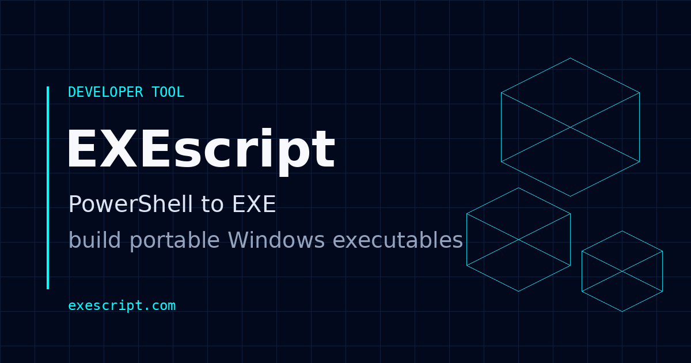

# EXEscript

**EXEscript** turns PowerShell scripts into portable Windows executables from a clean web interface.

**Website:** https://exescript.com/

## What it supports

- x64 and x86 Windows executables
- Windowed, Console, and Minimize-to-tray modes
- Windows PowerShell 5.1 and PowerShell 7+ runtime selection
- STA and MTA apartment modes
- UAC execution-level options
- DPI and long-path manifest options
- Single-instance applications
- Custom application icons with an EXEscript default icon
- Local `#_include` preprocessing and build-condition directives
- `.7z` downloads using Store/Copy packaging in the browser

## Try it

Open **https://exescript.com/**, add a `.ps1` script, choose the build options you need, and build your executable.

Generated executables are unsigned. Windows or security software may warn about newly generated unsigned applications.

## Repository status

This repository is currently the public home for **EXEscript** announcements, documentation, feedback, and issue tracking.

**The application source code is not published at this time.**

That may change later. For now, the goal is to make the project visible, document what it does, and give users a place to report bugs and suggest features.

## Feedback

Found a reproducible bug or have an idea for EXEscript? Open an issue and include:

- Windows version
- x86 or x64 build
- Console, Windowed, or Tray mode
- PowerShell runtime selected
- the smallest script that reproduces the problem, when safe to share

Please do not post secrets, credentials, private scripts, or sensitive data in public issues.

## Links

- Website: https://exescript.com/
- Issues: use the **Issues** tab in this repository

---

**EXEscript** · PowerShell to EXE
